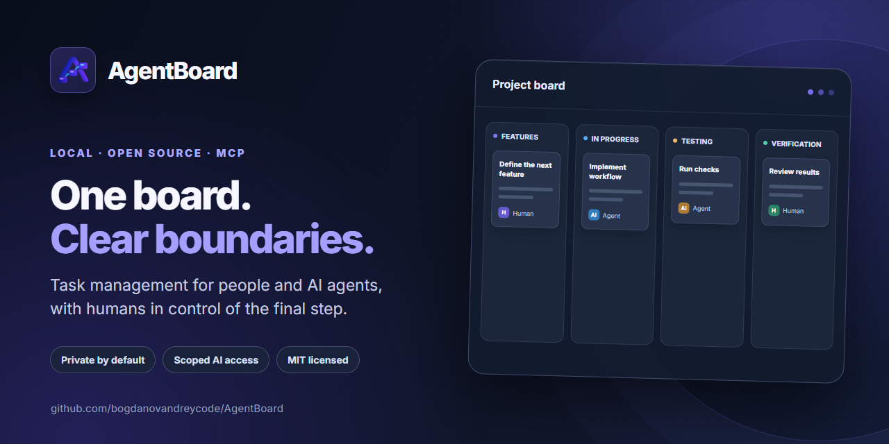

# AgentBoard

[🌐 Languages](../LANGUAGES.md)



**[تحميل لنظام التشغيل Windows](https://github.com/bogdanovandreycode/AgentBoard/releases/latest) · [موقع التوثيق](https://bogdanovandreycode.github.io/AgentBoard/) · [الترخيص MIT](../../LICENSE)**

AgentBoard عبارة عن لوحة مهام محلية حيث يعمل العاملون من البشر والذكاء الاصطناعي في مهام مشتركة، ولكن لديهم حقوق مختلفة. يتم تشغيل التطبيق بملف واحد `agentboard.exe`، ويفتح واجهة الويب في المتصفح ويزود العمال بخادم MCP منفصل عبر `stdio`. تبقى البيانات على جهاز الكمبيوتر الخاص بك.

**[ابدأ من الصفر](START_HERE.md) · [العمل مع المهام](TASKS.md) · [توصيل الذكاء الاصطناعي عبر MCP](WORKERS_MCP.md) · [استيراد JSON](IMPORT.md) · [الإعدادات](SETTINGS.md) · [حل المشكلات](TROUBLESHOOTING.md)**

## ميزات أفضل لاعب

- لوحة المشروع المحلية مع البحث عن المهام واستيراد JSON والأعمدة والخصائص المخصصة.
- وصول MCP لعامل معين مع انتقالات محدودة للذكاء الاصطناعي وقبول بشري نهائي للمهام.
- سجل المهام العام، والتحقق من التعليمات، والتحف، وتكاليف الذكاء الاصطناعي وتشخيص اتصال العامل.
- مثبت Windows وبيان ZIP وScoop؛ واجهة الويب مدمجة في الملف القابل للتنفيذ.

تم تصميم AgentBoard لمستخدم محلي موثوق به. لا يستضيف التطبيق مشاريع في السحابة ولا يقوم بتشغيل عملاء الذكاء الاصطناعي بنفسه؛ إذا لزم الأمر، قم بتوصيل عميل متوافق مع MCP بالعامل.

## في خمس دقائق

1. قم بتنزيل برنامج التثبيت `agentboard-VERSION-windows-amd64-setup.exe` من [Releases](https://github.com/bogdanovandreycode/AgentBoard/releases). سيقترح مجلدًا (افتراضيًا `C:\AI\AgentBoard`) وإضافته إلى `PATH`. Scoop و ZIP متاحان أيضًا.
2. افتح PowerShell في مجلد المشروع الخاص بك، على سبيل المثال `C:\Projects\MyApp`.
3. قم بتنفيذ `agentboard init` (للملف ZIP: المسار الكامل إلى `agentboard.exe` و`init`).
4. قم بتنفيذ `agentboard open`. سيتم فتح `http://127.0.0.1:7337`.
5. قم بإضافة مهمة باستخدام الزر **مهمة جديدة**. بالنسبة لعامل الذكاء الاصطناعي، افتح **العمال → إضافة عامل**، وحدد ملف تعريف العميل وانسخ تكوين MCP.

إذا لم يكن لديك مجلد مشروع بالفعل، فقم بإنشاء واحد في Windows Explorer. يمكن أن يكون المشروع أي مجلد، حتى بدون Git والتعليمات البرمجية.

## التثبيت عبر سكووب

في PowerShell مع [Scoop](https://scoop.sh/)] المثبت بالفعل بعد الإصدار:

```powershell
scoop install https://github.com/bogdanovandreycode/AgentBoard/releases/latest/download/agentboard.json
agentboard version
```

للمطورين هناك [بناء من المصدر ](INSTALL.md). يقوم سير عمل الإصدار بإنشاء برنامج تثبيت وبيان ZIP وScoop باستخدام SHA-256 من نفس المنتج. تحديث الإصدار المثبت عبر Scoop: `scoop update agentboard` بعد إضافة البيان إلى المجموعة؛ التفاصيل - [إعداد الإصدار ](SCOOP_RELEASE.md).

## كيف يتم هيكلة المجلس

`Backlog → Features → In progress → Testing → Verification → Complete`

يمكن لأي شخص نقل المهام حول اللوحة. يمكن للذكاء الاصطناعي تحريك `Features → In progress → Testing → Verification` فقط؛ يتم إجراء القبول النهائي في `Complete` بواسطة الإنسان. أعمدة المستخدم مخصصة للبشر: تظل المهمة فيها في حالة `Backlog` لـ MCP. أوضاع الاختبار: الذكاء الاصطناعي، والإنسان، والهجين. يتم إرفاق التاريخ والاختبارات والتحف وتكاليف الذكاء الاصطناعي بالمهمة.

## الفرق

```text
agentboard init [--db PATH] [project-path]
agentboard open [--addr 127.0.0.1:7337] [--db PATH] [project-path]
agentboard serve [--addr 127.0.0.1:7337] [--db PATH]
agentboard mcp --project PROJECT_PATH --worker WORKER_SLUG [--db PATH]
agentboard version
```

يقوم `init` بتسجيل المجلد ويكتب `.agentboard/project.json` فقط هناك. توجد بيانات إنتاج SQLite في دليل تكوين مستخدم Windows (`%AppData%\AgentBoard\agentboard.db`)، خارج المشروع وخارج تثبيت Scoop. لا ينبغي أن تؤدي إزالة الحزمة أو تحديثها إلى إزالة هذه البيانات. قبل النقل إلى كمبيوتر آخر، قم بعمل نسخة من قاعدة البيانات أثناء إيقاف AgentBoard.

العمال - حسابات منطقية. لا يقوم AgentBoard نفسه بتشغيل Codex أو Claude أو أي عميل آخر يعمل بالذكاء الاصطناعي. يبدأ العميل عملية MCP محلية لعامل معين. MCP هو حد إذن التطبيق، ولعزل الملفات، استخدم صندوق حماية عميل AI.

## للمطورين

المكدس: Go، SQLite، MCP Go SDK الرسمي، React، TypeScript، Vite، PrimeReact، TanStack Query، dnd-kit. أنشئ الواجهة الأمامية أولاً، ثم انتقل إلى: `./scripts/build.ps1`. يتم تضمين ملفات الويب في الملف الثنائي عبر `go:embed`. تم وصف البنية وواجهة برمجة التطبيقات في [doc/ARCHITECTURE.md](ARCHITECTURE.md).

## الترخيص

AgentBoard هو مشروع مجاني ومفتوح المصدر تحت [ترخيص MIT](../../LICENSE). يُسمح بالاستخدام التجاري والتعديل والتشعب وإعادة التوزيع بشرط الحفاظ على إشعار حقوق الطبع والنشر والترخيص.
